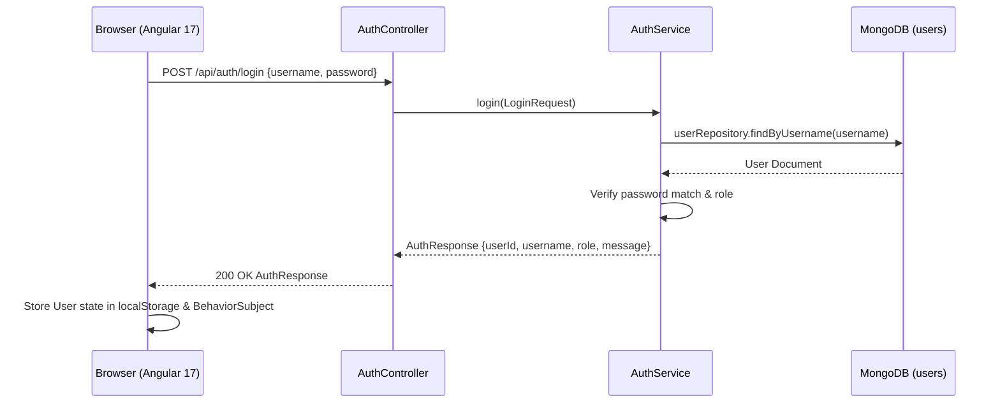

# 🔤 Guess the Word — Full-Stack Application (Angular + Spring Boot + MongoDB)

A feature-packed 5-letter word puzzle web application built with **Angular 17** (Frontend), **Spring Boot 3** (Backend), **MongoDB** (Database), and **Google Gemini LLM API** for real-time word validation.

---

## 📌 Table of Contents
- [✨ Key Features](#-key-features)
- [🔑 Demo Credentials](#-demo-credentials)
- [🔐 Authentication Sequence](#-authentication-sequence)
- [🏗️ Request & Architecture Flow](#️-request--architecture-flow)
- [🔗 API Endpoints Reference](#-api-endpoints-reference)
- [🗂️ Data Model Schema](#️-data-model-schema)
- [📁 Project Structure](#-project-structure)
- [⚡ Local Setup & Development](#-local-setup--development)
- [🚀 Deployment Guide](#-deployment-guide)

---

## ✨ Key Features

- 🤖 **Google Gemini API LLM Word Validation**:
  - Validates every submitted 5-letter guess against the **Google Gemini API** (with dictionary fallback).
  - Invalid 5-letter non-words (e.g. `ADGHT`) trigger a non-disruptive alert banner **without consuming an attempt**.

- 🔥 **LeetCode & GitHub-Style Consistency Heatmap**:
  - Displays a 30-day activity grid with LeetCode/GitHub dark mode color intensity levels (Level 0 to Level 3).
  - Includes a real-time `🔥 X Day Streak` badge and hover tooltips showing date-wise games played and wins.

- 🎮 **Daily Game Limit**:
  - Restricts players to **3 games per day**, with a dynamic `X of 3 games left today` badge counter.

- 🎯 **Interactive 5x5 Game Arena**:
  - Full support for both physical keyboard typing and an on-screen virtual keyboard with dynamic key color status updates.
  - **Color Feedback**:
    - 🟩 **GREEN**: Correct letter in the correct position.
    - 🟧 **ORANGE**: Correct letter in the wrong position.
    - ⬛ **GREY**: Letter not present in the target word.
  - Interactive win modal (celebratory win summary) and loss modal (revealing the target word).

- 📊 **Admin Reports & Analytics Portal**:
  - **Platform Overview**: Real-time KPI summary cards for *Total Players*, *Total Games*, *Total Wins*, *Global Win Rate*, *Active Players Today*, *Games Played Today*, and *Wins Today*.
  - **Daily Reports**: Toggle between *Single Day* summary cards and *Date Range* historical performance tables.
  - **Registered Users Directory**: Searchable directory with role filters (`admin` / `player`) and popover action menus (`View Heatmap Report`, `Edit User`, `Delete User`).

---

## 🔑 Demo Credentials

On initial database startup, default accounts are automatically seeded into MongoDB:

| Role | Username | Password | Dashboard Features |
| :--- | :--- | :--- | :--- |
| 👑 **Admin** | `AdminUser` | `Admin1$` | Platform Overview, System Daily Reports, User Management & Directory |
| 👤 **Player** | `PlayerOne` | `Player1*` | 3 Daily Games, 5x5 Game Arena, 30-Day Consistency Heatmap |

---

## 🔐 Authentication Sequence



---

## 🏗️ Request & Architecture Flow

```
Browser (Angular 17) ──> HttpClient Services ──> Spring Boot REST Controllers
                                                         │
                                              ┌──────────▼───────────┐
                                              │  Service Layer       │
                                              │                      │
                                              │  AuthService.java    │
                                              │  GameService.java    │ <── LlmValidationService (Gemini API)
                                              │  ReportService.java  │
                                              └──────────┬───────────┘
                                                         │
                                              ┌──────────▼───────────┐
                                              │  Spring Data Mongo   │
                                              │  (MongoRepository)   │
                                              └──────────┬───────────┘
                                                         │
                                              ┌──────────▼───────────┐
                                              │  MongoDB Database    │
                                              │  (users, sessions)   │
                                              └──────────────────────┘
```

---

## 🔗 API Endpoints Reference

### 🔑 Authentication (`/api/auth`)
| Method | Endpoint | Description |
| :--- | :--- | :--- |
| `POST` | `/api/auth/register` | Register a new user account (Username ≥ 5 chars, Password with special chars) |
| `POST` | `/api/auth/login` | Authenticate existing user and return user role & ID |

### 🎮 Gameplay (`/api/game`)
| Method | Endpoint | Description |
| :--- | :--- | :--- |
| `GET` | `/api/game/status?userId={id}` | Check active game session and remaining daily games |
| `POST` | `/api/game/start?userId={id}` | Initialize a new 5-letter game session |
| `POST` | `/api/game/guess` | Submit a 5-letter guess and receive tile feedback |
| `GET` | `/api/game/validate-word?word={w}` | Check word validity via Google Gemini API |

### 📊 Admin Analytics & Reports (`/api/reports`)
| Method | Endpoint | Description |
| :--- | :--- | :--- |
| `GET` | `/api/reports/overview` | Fetch Platform Overview KPIs (All-Time & Today stats) |
| `GET` | `/api/reports/daily?date={YYYY-MM-DD}` | Fetch daily active users and win counts for a date |
| `GET` | `/api/reports/range?startDate={d1}&endDate={d2}` | Fetch daily performance table across a date range |
| `GET` | `/api/reports/users-directory` | Fetch list of all registered users with stats |
| `GET` | `/api/reports/user/{userId}/consistency-heatmap` | Fetch 30-day consistency heatmap points for a player |
| `PUT` | `/api/reports/users/{id}` | Update username and role of a user |
| `DELETE` | `/api/reports/users/{id}` | Delete a user account from MongoDB |

---

## 🗂️ Data Model Schema

### 👤 `User` Document (`users`)
```json
{
  "_id": "65b...123",
  "username": "PlayerOne",
  "password": "Player1*",
  "role": "PLAYER",
  "joinedDate": "2026-08-14"
}
```

### 🎮 `GameSession` Document (`game_sessions`)
```json
{
  "_id": "sess_1723654000",
  "userId": "usr_playerone",
  "username": "PlayerOne",
  "targetWord": "PLANT",
  "status": "WON",
  "attempts": [
    {
      "guessedWord": "SMART",
      "feedback": ["ORANGE", "GREY", "GREEN", "ORANGE", "GREY"]
    },
    {
      "guessedWord": "PLANT",
      "feedback": ["GREEN", "GREEN", "GREEN", "GREEN", "GREEN"]
    }
  ],
  "playDate": "2026-08-15"
}
```

---

## 📁 Project Structure

```
WordGuess_Java/
├── backend/
│   ├── pom.xml
│   └── src/
│       ├── main/
│       │   ├── java/com/wordguess/
│       │   │   ├── WordGuessApplication.java
│       │   │   ├── config/ (CorsConfig.java, DataSeeder.java)
│       │   │   ├── controller/ (AuthController, GameController, ReportController)
│       │   │   ├── dto/ (AuthResponse, PlatformOverviewDto, DateRangeReportRowDto, UserDetailAdminDto, etc.)
│       │   │   ├── model/ (User, Word, GameSession, GuessAttempt, LetterStatus)
│       │   │   ├── repository/ (UserRepository, WordRepository, GameSessionRepository)
│       │   │   └── service/ (AuthService, GameService, LlmValidationService, ReportService)
│       │   └── resources/
│       │       └── application.properties
├── frontend/
│   ├── package.json
│   ├── angular.json
│   └── src/
│       ├── index.html
│       ├── main.ts
│       ├── styles.css
│       └── app/
│           ├── app.component.ts
│           ├── app.routes.ts
│           ├── models/ (auth.model, game.model, report.model)
│           ├── services/ (auth.service, game.service, report.service)
│           └── components/
│               ├── navbar/
│               ├── login/
│               ├── register/
│               ├── game/
│               └── admin-reports/
├── .gitignore
└── README.md
```

---

## ⚡ Local Setup & Development

### 1. Prerequisites
- **JDK 17+**
- **Node.js 18+** & **npm**
- **MongoDB** running locally on `mongodb://localhost:27017` (or Cloud MongoDB Atlas)
- **Google Gemini API Key** (Set variable `GEMINI_API_KEY`)

### 2. Start Backend (Spring Boot)
```bash
cd backend
./mvnw spring-boot:run
```
*(On Windows: `mvnw.cmd spring-boot:run`)*

The Spring Boot backend will run on **`http://localhost:8080`**.

### 3. Start Frontend (Angular)
```bash
cd frontend
npm install
npm start
```

The Angular application will run on **`http://localhost:4200`**.

---

## 🚀 Deployment Guide

### Package Backend JAR
```bash
cd backend
./mvnw clean package -DskipTests
```
Generates production JAR at `backend/target/wordguess-backend-1.0.0.jar`.

### Package Frontend Production Bundle
```bash
cd frontend
npm run build
```
Generates static production assets at `frontend/dist/wordguess-frontend/browser/`.
